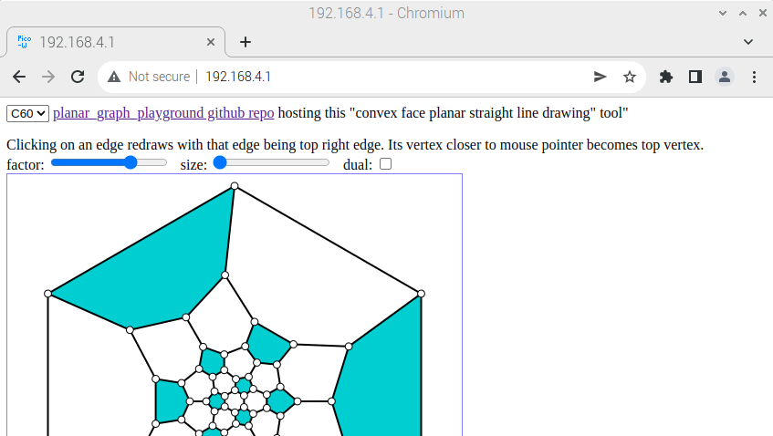

# Pico W

MicroPython static page web server (planar_graph_playground):
=============================================================

Install a MicroPython that supports Pico-W:  
[https://micropython.org/download/rp2-pico-w/](https://micropython.org/download/rp2-pico-w/)

Then install ampy.  
Then copy all needed files onto Pico-W by running "install" in "MicroPython/I Pico W LED web server".  

Afterwards power cycle the Pico-W. When connected to its AP (192.168.4.X), use 192.168.4.1 in your browser:  
http://192.168.4.1

This will serve planar_graph_playground from Pico-W, which is available here as well:  
[https://hermann-sw.github.io/planar_graph_playground/](https://hermann-sw.github.io/planar_graph_playground/)  

Pico-W being an AP allows to use planar_graph_playground without any wireless lan.  
"index.html" referencs 7 external .js files, and webserver serves "Pico-W" favicon.ico as well.  
Currently there is a single file size limit of 6536 bytes than can be served:  

